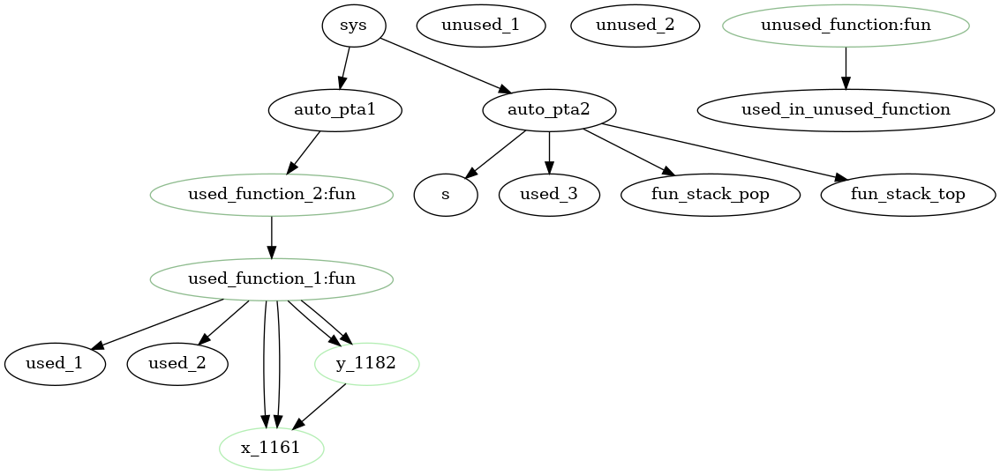

# I. Parsing structure tools

## ParsingStructureUtilities module

This module contains a lot of generic functions that allow you to easily traverse and fold the parsing structure tree and applying a given function to the leaves of the tree. Like `List` in OCaml, this module contains `fold`, `exists`, `for_all`, `iterate` functions on all parsing structure types.

Note that a __leaf__ in parsing structure is either a variable, constant, a function call or a variable update (assignment).

```ocaml
(* Leaf for parsing structure *)
type parsing_structure_leaf =
    | Leaf_variable of variable_name
    | Leaf_constant of DiscreteValue.discrete_value
    | Leaf_fun of variable_name
    | Leaf_update_variable of variable_name
```


### Some examples

__Example 1__:
```ocaml
(* Check if leaf is a constant *)
let is_constant variable_infos = function
    | Leaf_variable variable_name -> is_constant_is_defined variable_infos variable_name
    | Leaf_constant _ -> true
    | Leaf_fun _
    | Leaf_update_variable _ -> false
    
(* Check if a parsed boolean expression is constant *)
let is_parsed_boolean_expression_constant variable_infos =
    for_all_in_parsed_boolean_expression (is_constant variable_infos)
```
____________

## ParsingStructureMeta module

This module contains all higher order level function on parsing structure. Like: 

 - getting all variables of a given expression
 - check if an expression is linear
 - check if an expression is constant
 - ...

Of course, this module use `ParsingStructureUtilities`.
____________

## Linking of variables

In order to recognize each variable in a unique way, we have to use its name. But it's not sufficient. For example, a local variable, can be defined many times with the same name, it's also possible to have global and local variable with the same name, or it's possible to have a formal parameter with the same name of a global variable. For this reason, in addition to its name, we choose to add an identifier to each variable.

A variable can be seen internally as a tuple `(variable_name * id)`. This tuple represent variable in a unique way.

On the parsing step, more precisely, on the parsing of declarations (global or local) we construct tuple by getting the variable name, and the first character position of the variable name for its identifier.

For example:
```
var i : int = 0;
var j : int = 1;
```
Construct the following tuples: `(i, 5)`, `(j, 22)`. Because `i` was found at the 5th position and `j` at the 22th position in the model.

Now we have to associate variable reference to their declaration. For example in the code bloc below, we have a reference to variables `i`, `k` and `j`. In order to compute the return statement, we have to know of which `i`, `j` and `k` we talk about.

```
function f(i : int) : int 
begin 
    var k : int = 10;
    var k : int = 0;
    return i + k + j;
end
```

In the previous example, `i` should be associated to formal parameter `i`, `k` to just previously declared local variable and `j` to global variable. This is the aim of variable linking.

Variable linking was made by calling the function `link_variables_in_parsed_model`. It take a `parsed_model` as parameter and return a new `parsed_model` with all variables linked to their declarations (each variable have an id set). 

As you can see, this function is used directly at the beginning of the `abstract_structures_of_parsing_structures` function in `ModelConverter` module to generate the new parsed model with all variables linked.

__Note:__ 

If you want to see variable linking in action, you could use the following command: `imitator model.imi -no-var-autoremove -verbose high | grep "link"`.

## ParsingStructureGraph module (graph dependency resolver)

When the user making a model, he declares some automatons, global variables, user defined functions, local variables, etc. Each of them (called a "component" of the model) have relations. The only relation described is `use`. For example, `pta1` use `i`.

The main principle of the dependency resolver is to create a dependency graph of the components of the model. It gathers all global variables, user defined functions, local variables, etc. and link them together following some rules.

### Graph dependency goal

Graph dependency is used to detect used / unused variables and functions of the model and found cycles between functions, etc.

Graph dependency can easily be traversed using recursive functions.

### Internal representation

Internally, the dependency graph is represented through a tuple `(component list * relation list)`. The first tuple element is the list of the components of the model. The second tuple element is the list of relations between these components.

The list of the relations is represented through a list of tuples, and as a relation is `relation = component * component`, so a list of relation is `(component * component) list`. A relation between two component `x` and `y` `('x', 'y')` can be read as `x` use `y`.

Finally, a component is a unique reference to some program component.

__An example of dependency graph for the following model:__

```IMITATOR
var

  s : int stack;
  used_1, used_2, used_3 : int;
  unused_1, unused_2 : int;
  used_in_unused_function : int;

(* used_function_1 used because not used by any pta *)
fn unused_function() : int
begin
  used_in_unused_function + 1
end

(* used_function_1 used because used pta1 *)
fn used_function_2() : int
begin
  used_function_1()
end

(* used_function_1 used because used by used_function_2 *)
fn used_function_1() : int
begin
  let x : int = 1 in
  let y : int = x + 2 in
  used_1 + x * used_2 + y
end

automaton pta1

  loc s0: invariant True
  when used_function_2() = 0 goto lend;

  accepting loc lend : invariant True

end

automaton pta2

  loc s0: invariant True
  when True
  do {
    seq
      (* used_3 used because in seq update (see rules) *)
      used_3 := stack_pop(s);
    then
      (* unused_1 not used because used only in not sequential update *)
      unused_1 := stack_top(s)
  }
  goto lend;

  accepting loc lend : invariant True

end


init := {
  discrete =
    loc[pta1]:=s0,
    loc[pta2]:=s0
  ;

}
```



__Note__:

IMITATOR have a function that return a string representation of the dependency graph in the [DOT format](https://graphviz.org/docs/layouts/dot/).

If you want to generate a visual view of graph dependency of the model, you can use these commands below:

- `imitator model.imi -verbose high | grep "digraph" > model.dot`
- Then, `dot model.dot > model.png`

It's possible that `dot` file contains some illegal characters. In this case you have to manually remove it before executing the second command. You need to have [DOT](https://graphviz.org/docs/layouts/dot/) installed on your computer.


### Relation creation rules

Below, the list of rules describing when a relation is created between two components according to their type.

__system -> automatons__

Each declared automatons are considered as used by the system. Relation between these two components are always created. There is only one system (it's the representation of the model).

__automaton -> global variable__

Create:
- A global variable is used in a guard / invariant
- A global variable is assigned in a sequential update

Don't create:
- A global variable is assigned in a non sequential update

__automaton -> function__

Create:

- A function is used in a guard / invariant
- A function is used in an update

__variable -> variable__

- A l-value variable is assigned by right member variables

#### Between functions and local variables

Local variables are always considered as used. They are all reachable from system through their relation with the function (where they are declared).

### Unused components

We consider as __used__ all components reachable from `system` (`sys` as you can see on the picture above). In order to find unused components of the model, we just get the dependency graph of the model, and make difference between all declared components of the model and all components reachable from `system`. It means `all_components - used_components`.

#### Unused components remove rules

- Unused global variables are removed automatically from the model if the option `-no-var-autoremove` is not set.
- Unused user defined functions are always removed from the model.
- Unused function parameter are only reported as a warning.
- There is no unused local variables possible (see rules), so they will never be removed.
____________
____________

# II. Type checking / type inference

 - Module: `ExpressionConverter`
 - Functions: `type_check_{variant_type}`

Type checking is the process that check the type consistency of expressions and eventually infer the type of some literal values.

__Type checking functions helps to:__

 - Traverse the expression tree
 - Deduce the types of the factors and sub-expressions of the tree
 - Eventually infer the type of the factors of an expression
 - Check that all sub-expressions are type compatibles
 - Return a __typed tree__

Factors can be a variable, a literal value, a function call. 

Type check functions produce a __typed tree__ from __parsing tree__. The __typed tree__ is exactly the same as the __parsing tree__ but hold extra information that is the type of the expression.

Then the produced __typed tree__ can be converted to the __abstract tree__ which is the target for executing IMITATOR algorithms.

__Below a model example with some expressions that can be type checked:__

```ocaml
var

  i1, i2 : int;
  r1, r2 : rat;


automaton P

  loc s0: invariant True
  (* type error because expression mix int and rat *)
  when i1 + r1 = 10 goto lend;
  (* type error because a guard should be a bool expression *)
  when i1 goto lend;
  (* expression below is ok, because 5 is inferred to rat *) 
  when r1 * r2 = 5 goto lend; 
  (* expression below is ok, because 5 is inferred to int *)
  when i1 * i2 = 5 goto lend;
  (* expression below is ok, as all literals are numbers *)
  (* expression will be converted as a rat expression *)
  when 2 * 2 = 4 goto lend;
  do {
    seq
      (* ok *)
      i1 := 8 * 2 + i2;
      (* ok as i1 is converted to rat *)
      r1 := rational_of_int(i1);
      (* type error, because 4 is inferred to int because i1 is int *)
      r2 := 4 * i1;
  }
  accepting loc lend : invariant True

end
```

## Literal values

The type of literal values can generally be inferred directly, when this isn't the case, __weak types__ are associated to these values.

| Literal value form | Type |
|-------------|---|
| `True` | `bool` |
| `False` | `bool` |
| `['0'-'9']*'.'['0'-'9']+` | `rational` |
| fractional number (eg: `5/3`) | `rational` |
| `['0'-'9']+` | `weak number` |
| `"0b"['0'-'9']+` | `binary` |
| `[]` | `weak array` |
| `list([])` | `weak list` |
| `stack()` | `weak stack` |
| `queue()` | `weak queue` |

## Weak types

__Weak types__, are temporary types linked to some values that we don't know the type for the moment. After the conversion from parsing structure to abstract model, there isn't any weak type left. It exists two weak types: `weak number` and `weak`. Weak types are inferred at the type checking step.

### Weak number type

By default, all literals numbers that aren't fractional (and without dot), for example `1`, `5`, `326` are of type `weak number` which mean: this value is a number, but for the moment, we don't know if it's a rational or an integer.

### Weak type

By default, all __empty__ arrays are of type `weak array`, lists of type `weak list`, and so on for stacks and queues. It means: this is an array (or list, ...) but for the moment, we don't know his inner type.

## Compatible types

Values with compatible types can be mixed in the same expression.

| Type A| Type B|
|-------|-------|
| `bool`  | `bool` |
| `rat`   | `rat`  |
| `rat`   | `weak number` |
| `int`   | `int`   |
| `int`   | `weak number` |
| `binary(l)`   | `binary(l)` |
| `'a array(l)`   | `'a array(l)` |
| `'a array(l)`   | `weak array(l)` |
| `'a list`   | `'a list` |
| `'a list`   | `weak list` |
| `'a stack`   | `'a stack` |
| `'a stack`   | `weak stack` |
| `'a queue`   | `'a queue` |
| `'a queue`   | `weak queue` |

## Type strength

Only compatible types can be compared. Note: `'a` is any non-weak type. A stronger type can replace a weaker type if compatible.

 - `weak < 'a`
 - `weak < weak number`
 - `weak number < rat`
 - `weak number < int`
 - `weak array(l) < 'a array(l)`
 - `weak list < 'a list`
 - `weak stack < 'a stack` 
 - `weak queue < 'a queue`

## Inference

To be inferred, a value type must be a `weak number` or a `weak sequence` (`weak array(l)`, `weak list`, ...). Moreover, type inference of a value can only be made if the given infer type is __compatible__ with the value type and the given infer type is __stronger__ than the value type.

Whenever a sub-expression compound of many terms is reach, we compare the strength of each term. The stronger type is keep. This enables to infer weak type to stronger types. For example:

```ocaml
2 + 4 * i

produce the tree

    +
   / \
  2   *
     / \
    4   i
```

When traversing the tree expression, type checking functions do the following:

 - deduce `4` as `weak number` 
 - deduce variable `i` as `int`
 - check that two factors are compatibles
 - check that `*` operator is used on number types
 - get the stronger type between the two terms, so as `weak number < int`, it get `int`
 - deduce `2` as `weak number`
 - check that two terms are compatibles
 - check that `+` operator is used on number types
 - get the stronger types between the two factors, so as `weak number < int` it get `int`
 
### Assignment inference

When an assignment to a variable is made (in an update for example), the type of the assigned variable is passed as argument in the type checking functions.

Therefore, when a literal value with weak type is reach, the literal value is directly inferred, if possible, to the same type as the type given as argument. If it's not possible, a type error is raised immediately. For example: 

```ocaml
var i : int;
...
do {
    (* 8, 2 literals will be inferred to int *)
    i = 8 + 2
}
```

```ocaml
var b : bool;
...
do {
    (* 8, 2 literals cannot be inferred to bool, so an error is raised *)
    b = 8 + 2
}
```

### Note on weak typed expressions

If the expression remains weak typed after type checking it's not a problem. When the converter will reach it, it will convert this expression to the default type `rational`. For examples:

- `5 + 8 * 2` will be deduced as `weak number` and converted to a rational expression.
- `[]` will be deduced as `weak array(0)` and converted to `rational array(0)`.
- `[2, 4]` will be deduced as `weak number array(2)` and converted to `rational array(2)`.

____________

## Type constraint resolver (function signature inference)

In order to resolve type signature of built-in and user defined function, there is a module called `TypeConstraintResolver` that use `DiscreteType` and `FunctionSig` module to resolve the effective signature of a function according to the arguments passed when call it.

__All type constraint resolutions and type checking of the functions was made in `ExpressionConverter` module at `Parsed_function_call` case.__

### Type constraints

Type constraints are used to define functions signatures. For example, `list_cons` has the signature:

```ocaml
Type_name_constraint "a";
Defined_type_constraint (List_constraint (Type_name_constraint "a"));
Defined_type_constraint (List_constraint (Type_name_constraint "a"))
```

which mean: `'a -> 'a list -> 'a list`. In other words, `list_cons` take as arguments an element of type `a`, a list of type `a` and return a list of type `a`. 

### Type constraint resolver

The `TypeConstraintResolver` module aim to resolve the actual signature of a function according to the way it was called, and check that there isn't any inconsistency between the given argument types. It enables to make the type checking on built-in and user defined functions calls.

In this example above `a` is a type constraint that can be replaced by any type. A user can call this function in different ways, for example: `my_bool_list = list_cons(True, my_bool_list)`, `my_int_list = list_cons(1, my_int_list)`... In the first case, the type constraint resolver should resolve the call with signature `bool -> bool list -> bool list`, in the second case as `int -> int list -> int list`.

In case of inconsistency, an error should be raised. For example, if the user make a call like this `my_bool_list = list_cons(0, my_bool_list)`, the actual signature is `int -> bool list -> weak` and type constraint `a` was resolved at the same time as `int` and `bool` which is inconsistent.

### Dependent types

Dependent types are types dependent to a value. In IMITATOR, array(k) and binary(k) are dependent types, because the value of their lengths takes part of the type. For example, `int array(1)` is not the same type as `int array(2)` and `binary(1)` is not the same type as `binary(2)`.

The value of length, __must be a constant expression__. It means that this expression must be resolved at the "compile" time. It's because IMITATOR need to resolve value of the length in the semantic analysis process in order to know the type of variables when the type checking is executed.

Type constraints can represent dependent type, for example, `array_append` has the signature: 

```ocaml
Defined_type_constraint (Array_constraint (Type_name_constraint "a", Length_constraint_expression (Length_scalar_constraint "l1")));
Defined_type_constraint (Array_constraint (Type_name_constraint "a", Length_constraint_expression (Length_scalar_constraint "l2")));
Defined_type_constraint (Array_constraint (Type_name_constraint "a", Length_constraint_expression (Length_plus_constraint ("l1", Length_constraint_expression (Length_scalar_constraint "l2")))));
```

which mean: `'a array(l1) -> 'a array(l2) -> 'a array(l1 + l2)`. In other words, the function has an array of type `a` and length `l1`, an array of type `a` and length `l2` as arguments, and return an array of type `a` and length `l1` + `l2`.

# III. Conversion

 - Module: `ExpressionConverter.Convert`, `DiscreteExpressionConverter`
 - Functions: `{abstract_expression}_of_{typed_expression}`

When type checking succeed (no type errors), we obtain a __typed tree__ of the type checked expression. This __typed tree__ can now be converted into an __abstract tree__.

The functions that makes the conversion just traverse the typed tree and look at the type of each sub-expressions to choose the correct tag of the abstract tree.

For example the typed tree: `{i : int} + {2 : int} * {5 : int}` will be converted to an int arithmetic expression.

____________

# IV. Updates

## Sequential and continuous updates

All updates are triggered from the `AlgoStateBased` module, by using the `DiscreteExpressionEvaluator` module.

There is two types of update:

 - Sequential update (Direct update)
 - Delayed update

Updates are makes at `AlgoStateBased.compute_new_location_guards_updates`.

### Sequential

TODO

____________

## Assignment mode

### Assignment by copy

In an update, in both sequential or not-sequential, variables are assigned by copy. It means that when we make an assignment of one variable `x` to another `y`, the value of `x` is copied to `y`. The two variables are independent. Therefore, modifying the value of one of these doesn't impact the value of the other.

For example in the update `a := b`, `b` is copied and assigned to `a`. This behavior is valid whatever the type of the variable.
The described copy is a deep copy.

Why ? because as a function can be executed many time in a given transition, using reference instead of a copy of a variable make unpredictable results. Especially when update is make through a user function used in a guard or invariant (as they may be called many time given one transition).

The function that make the copy can be found at `Location.copy_discrete`.

### Assignment by reference

The only case where a variable is assigned by reference, is when we get the return value of some side effect functions like `stack_push`, `stack_clear`, `queue_push` and `queue_clear`. In this case, the reference returned is the reference to the element that is modified by the function.

For example:

```
(* here s1 get the ref of s2 *)
s1 := stack_push(0, s2);
(* We push an element to s2 *)
stack_push(1, s2);
(* After instruction above s1 is a ref to s2 s1 = [0, 1] ans s2 = [0, 1] *)
```

Why ?

The side effect builtin functions in IMITATOR aims to perform quick operations and avoid long copy. Moreover, a side effect function cannot be used in a guard / invariant, therefore it's safe to get a reference in the case of an update, because it will be performed just one time by transition.

The functions that return reference can be found at:

 - `DiscreteExpressionEvaluator.eval_stack_expression_with_context`
 - `DiscreteExpressionEvaluator.eval_queue_expression_with_context`

____________

## Value packing

TODO
